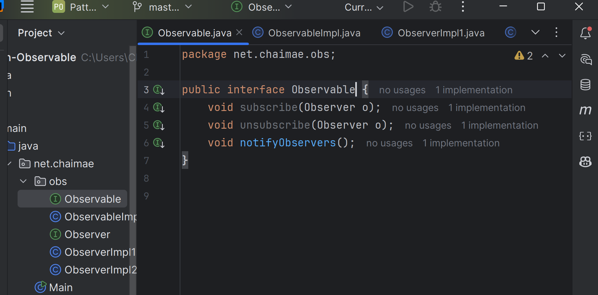
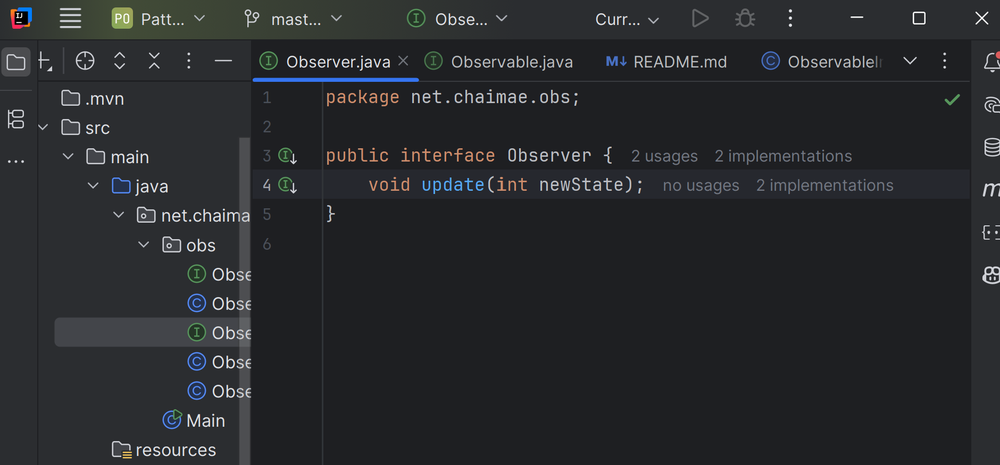
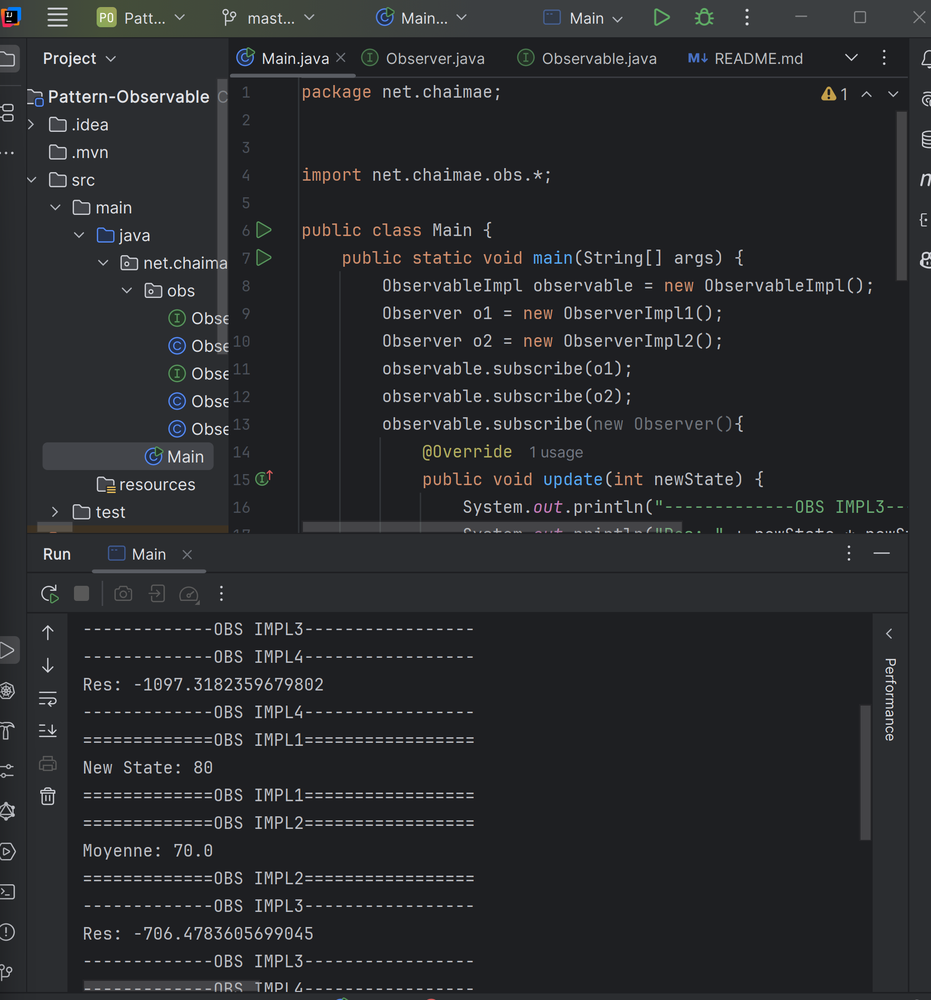
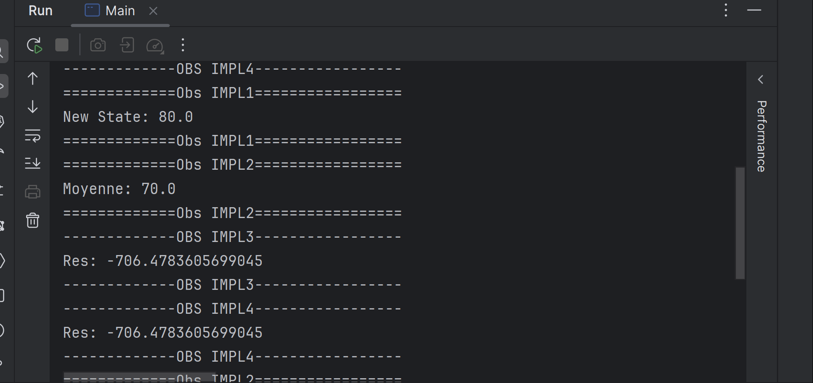

# DesignPattern-Observer

## 1. Definition of the Observer Design Pattern

The **Observer Design Pattern** is a behavioral design pattern that establishes a one-to-many dependency between objects. When the state of an object changes, all its registered observers are automatically notified and can react to that change.

This pattern is useful when multiple objects need to be informed about changes in another object without being tightly coupled to it.

### Objectives

- Notify multiple objects when the state of another object changes.
- Reduce coupling between the observable object and its observers.
- Allow new observers to be added without modifying the observable class.
- Improve the flexibility, extensibility, and maintainability of the application.

## 2. How It Works

The Observer Pattern relies on two main components:

1. **Observable:** Maintains a collection of observers and notifies them when its state changes.
2. **Observer:** Defines a common interface that observers implement to receive updates.

The general workflow is as follows:

1. An observer registers with the observable.
2. The observable's state changes.
3. The observable notifies all registered observers.
4. Each observer executes its `update()` method to react to the change.
5. Observers can be removed when they no longer need notifications.

## 3. Observable Class

The `Observable` class manages the application's state and the observers interested in changes to that state.

It maintains a collection of observers and provides methods to manage subscriptions and notify observers when an update occurs.

### Main Responsibilities and Methods

- **`addObserver()`**: Registers an observer to receive notifications.
- **`removeObserver()`**: Removes an observer from the notification list.
- **`notifyObservers()`**: Notifies all registered observers when the state changes.
- **State management methods**: Update the observable's state and trigger notifications when appropriate.

These are common method names in an Observer implementation; the exact names depend on the code.

## 4. Observer Class

The `Observer` interface defines the contract that all observers must implement.

It declares the `update()` method, which is called by the observable when a change occurs. Each observer can implement this method differently according to its specific responsibilities.

### Main Responsibilities and Methods

- **`update()`**: Receives a notification and processes the new state or event.
- **Custom behavior**: Each implementation defines how it reacts to notifications.

Using an interface allows the observable to communicate with different observer implementations without depending on their concrete classes.

## 5. Main Execution Result

The `main` method demonstrates the interaction between the observable and its observers.

During execution, observers can be registered, the observable's state can be modified, and notifications can be sent to the registered observers.

### Execution Workflow

1. Create an observable object.
2. Create one or more observer objects.
3. Register the observers with the observable.
4. Change the observable's state.
5. Observe how each registered observer reacts to the notification.

This example illustrates how a single state change can trigger updates in multiple objects.

## 6. Casting in Java

**Casting** is the process of converting a reference from one type to another compatible type.

In Java, casting is often used when working with inheritance, interfaces, and polymorphism.

### Types of Casting

- **Upcasting:** Assigning an object of a subclass to a reference of its superclass or an implemented interface. This is generally performed implicitly.
- **Downcasting:** Converting a superclass or interface reference back to a more specific subtype. This requires an explicit cast and can throw a `ClassCastException` if the object is not an instance of the target type.

### Example in the Observer Pattern

An observable may store observers using the `Observer` interface rather than their concrete implementation classes. This allows it to handle different observer types uniformly through polymorphism.

Downcasting is only necessary when code needs access to functionality specific to a concrete implementation that is not exposed by the interface.

## 7. Advantages of the Observer Design Pattern

- **Loose coupling:** The observable does not need to know the internal details of its observers.
- **Extensibility:** New observer implementations can be added without changing the observable.
- **Reusability:** Observer implementations can be reused in different contexts.
- **Automatic notifications:** Registered observers are notified when the observable's state changes.
- **Separation of responsibilities:** State management and reactions to state changes remain in separate classes.

## 8. Conclusion

The Observer Design Pattern provides a flexible mechanism for communication between objects. The observable manages its state and registered observers, while each observer defines its own response to notifications.

This pattern is particularly useful in event-driven applications, notification systems, graphical user interfaces, and monitoring systems where multiple components need to react to changes.

## Technologies and Concepts

- **Language:** Java
- **Design Pattern:** Observer (Behavioral)
- **Java Concepts:** Interfaces, encapsulation, polymorphism, collections, method overriding, and casting

